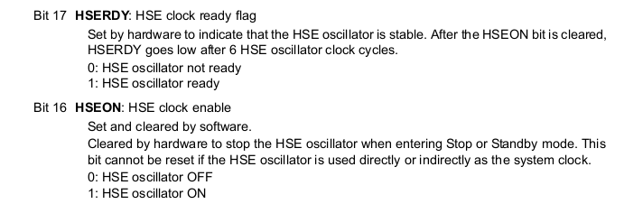
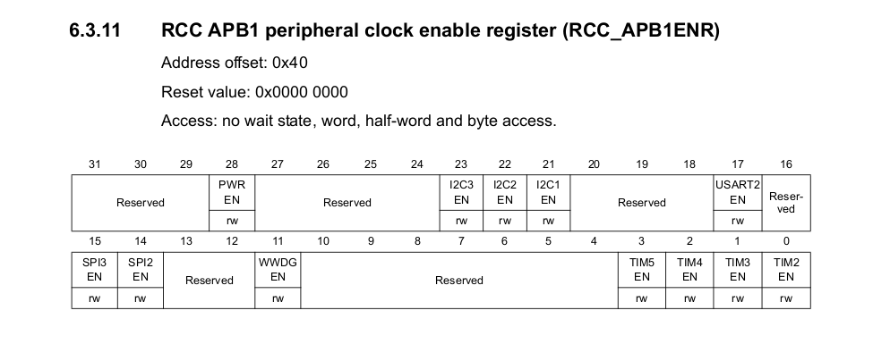
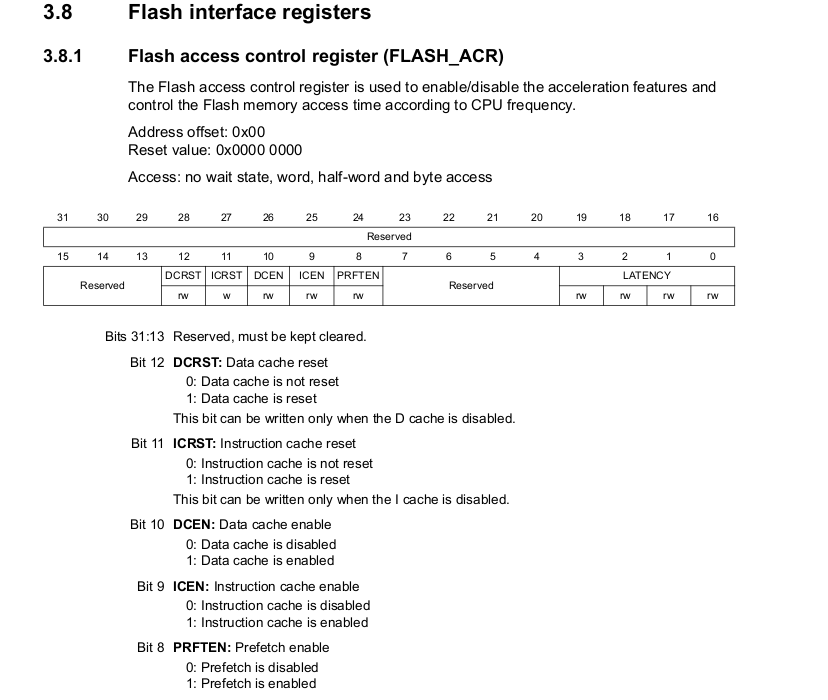
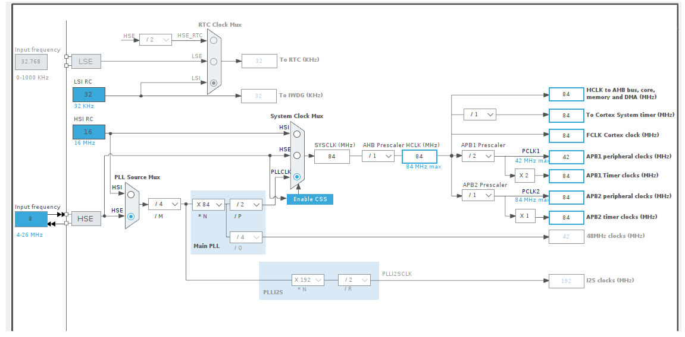
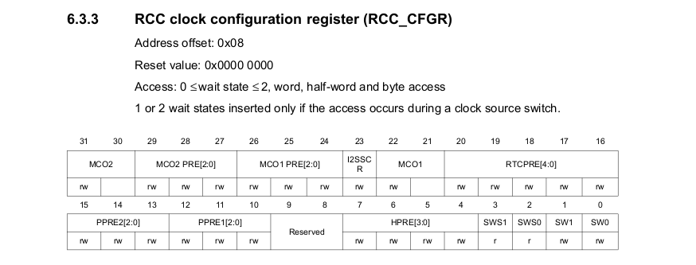
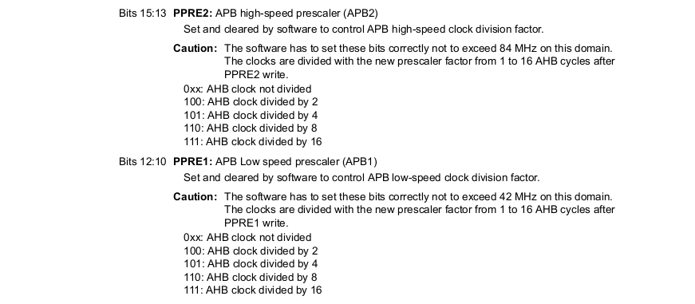

## LED Blinking Documentation

**Table of Contents**:

- [LED Blinking Documentation](#led-blinking-documentation)
  - [Enable HSE and Wait for the HSE to Become Ready](#enable-hse-and-wait-for-the-hse-to-become-ready)
  - [Set Power Enable Clock and Voltage Regulator](#set-power-enable-clock-and-voltage-regulator)
  - [Configure the Flash Prefetch and Latency Related Settings](#configure-the-flash-prefetch-and-latency-related-settings)
  - [](#)

### Enable HSE and Wait for the HSE to Become Ready

**Reset & Clock Config (91 pages - )**:

- Page-103:

```
RCC_CR register: RCC Clock Control Register.

0-31 bits.

16: HSE ON       ; SET 1 (HSE Oscilllator ON)
17: HSE READY    ; WAIT UNTIL 1

24: PLL ON       ; SET 1
25: PLL READY    ; WAIT UNTIL 1
```



`In stm32f401cxx.h` header...

- In line (3900 - 3902)

```
RCC_CR_HSEON: 0x1UL << 16U; 
```

- In line (3903 - 3905)

```
RCC_CR_HSERDY: 0x1UL << 17U;
```

Source code for `HSE On` & `HSE Ready`:

```c
RCC->CR |= RCC_CR_HSEON;
while(!(RCC->CR & (RCC_CR_HSERDY)));
// This will indicate the HSE Crystal is ON
```

### Set Power Enable Clock and Voltage Regulator

- Enable the power interface clock and set the voltage regulator.

Power Enable in RCC_APB1 -> 28th bit register. `(Page - 119)`




In header,

```
Line (4337 - 3339),

RCC_APB1ENR_PWREN: 0x1UL << 28U;
```

```c
// Enable power interface clock.
RCC->APB1ENR |= RCC_APB1ENR_PWREN;
```

- Voltage Regulator

For voltage regulator (Power Controller):

`PWR_CR`: Power Control Register.

```c
PWR->CR |= PWR_CR_VOS;
```

### Configure the Flash Prefetch and Latency Related Settings



```c
// In header,  (2290 - 2314)

/*******************  Bits definition for FLASH_ACR register  *****************/
#define FLASH_ACR_LATENCY_Pos          (0U)
#define FLASH_ACR_LATENCY_Msk          (0x7UL << FLASH_ACR_LATENCY_Pos)         /*!< 0x00000007 */
#define FLASH_ACR_LATENCY              FLASH_ACR_LATENCY_Msk
#define FLASH_ACR_LATENCY_0WS          0x00000000U
#define FLASH_ACR_LATENCY_1WS          0x00000001U
#define FLASH_ACR_LATENCY_2WS          0x00000002U
#define FLASH_ACR_LATENCY_3WS          0x00000003U
#define FLASH_ACR_LATENCY_4WS          0x00000004U
#define FLASH_ACR_LATENCY_5WS          0x00000005U
#define FLASH_ACR_LATENCY_6WS          0x00000006U
#define FLASH_ACR_LATENCY_7WS          0x00000007U


#define FLASH_ACR_PRFTEN_Pos           (8U)                                    
#define FLASH_ACR_PRFTEN_Msk           (0x1UL << FLASH_ACR_PRFTEN_Pos)          /*!< 0x00000100 */
#define FLASH_ACR_PRFTEN               FLASH_ACR_PRFTEN_Msk                    
#define FLASH_ACR_ICEN_Pos             (9U)                                    
#define FLASH_ACR_ICEN_Msk             (0x1UL << FLASH_ACR_ICEN_Pos)            /*!< 0x00000200 */
#define FLASH_ACR_ICEN                 FLASH_ACR_ICEN_Msk                      
#define FLASH_ACR_DCEN_Pos             (10U)                                   
#define FLASH_ACR_DCEN_Msk             (0x1UL << FLASH_ACR_DCEN_Pos)            /*!< 0x00000400 */
#define FLASH_ACR_DCEN                 FLASH_ACR_DCEN_Msk                      
```

```c
/* configure flash prefetch & latency related settings */
/* 8 -> PRFTEN, 9 -> ICEN, 10 -> DCEN */
/* FLASH->ACR = (1U << 8U) | (1U << 9U) | (1U << 10) | ; */
/* Latency 2ws */

FLASH->ACR |= FLASH_ACR_ICEN | FLASH_ACR_DCEN | FLASH_ACR_PRFTEN | FLASH_ACR_LATENCY_2WS;
```

### Configure Prescaler (Main Clock & Peripheral Clock

```c	
/* 
** AP1 Prescaler is 2
** AP2 Prescaler is 1
** AHB Prescaler is 1
*/
```



**RCC_CFGR**:




```c
/*!< HPRE configuration */
#define RCC_CFGR_HPRE_Pos                  (4U)                                
#define RCC_CFGR_HPRE_Msk                  (0xFUL << RCC_CFGR_HPRE_Pos)         /*!< 0x000000F0 */
#define RCC_CFGR_HPRE                      RCC_CFGR_HPRE_Msk                   /*!< HPRE[3:0] bits (AHB prescaler) */
#define RCC_CFGR_HPRE_0                    (0x1UL << RCC_CFGR_HPRE_Pos)         /*!< 0x00000010 */
#define RCC_CFGR_HPRE_1                    (0x2UL << RCC_CFGR_HPRE_Pos)         /*!< 0x00000020 */
#define RCC_CFGR_HPRE_2                    (0x4UL << RCC_CFGR_HPRE_Pos)         /*!< 0x00000040 */
#define RCC_CFGR_HPRE_3                    (0x8UL << RCC_CFGR_HPRE_Pos)         /*!< 0x00000080 */

#define RCC_CFGR_HPRE_DIV1                 0x00000000U                         /*!< SYSCLK not divided    */
#define RCC_CFGR_HPRE_DIV2                 0x00000080U                         /*!< SYSCLK divided by 2   */
#define RCC_CFGR_HPRE_DIV4                 0x00000090U                         /*!< SYSCLK divided by 4   */
#define RCC_CFGR_HPRE_DIV8                 0x000000A0U                         /*!< SYSCLK divided by 8   */
#define RCC_CFGR_HPRE_DIV16                0x000000B0U                         /*!< SYSCLK divided by 16  */
#define RCC_CFGR_HPRE_DIV64                0x000000C0U                         /*!< SYSCLK divided by 64  */
#define RCC_CFGR_HPRE_DIV128               0x000000D0U                         /*!< SYSCLK divided by 128 */
#define RCC_CFGR_HPRE_DIV256               0x000000E0U                         /*!< SYSCLK divided by 256 */
#define RCC_CFGR_HPRE_DIV512               0x000000F0U                         /*!< SYSCLK divided by 512 */

/*!< PPRE1 configuration */
#define RCC_CFGR_PPRE1_Pos                 (10U)                               
#define RCC_CFGR_PPRE1_Msk                 (0x7UL << RCC_CFGR_PPRE1_Pos)        /*!< 0x00001C00 */
#define RCC_CFGR_PPRE1                     RCC_CFGR_PPRE1_Msk                  /*!< PRE1[2:0] bits (APB1 prescaler) */
#define RCC_CFGR_PPRE1_0                   (0x1UL << RCC_CFGR_PPRE1_Pos)        /*!< 0x00000400 */
#define RCC_CFGR_PPRE1_1                   (0x2UL << RCC_CFGR_PPRE1_Pos)        /*!< 0x00000800 */
#define RCC_CFGR_PPRE1_2                   (0x4UL << RCC_CFGR_PPRE1_Pos)        /*!< 0x00001000 */

#define RCC_CFGR_PPRE1_DIV1                0x00000000U                         /*!< HCLK not divided   */
#define RCC_CFGR_PPRE1_DIV2                0x00001000U                         /*!< HCLK divided by 2  */
#define RCC_CFGR_PPRE1_DIV4                0x00001400U                         /*!< HCLK divided by 4  */
#define RCC_CFGR_PPRE1_DIV8                0x00001800U                         /*!< HCLK divided by 8  */
#define RCC_CFGR_PPRE1_DIV16               0x00001C00U                         /*!< HCLK divided by 16 */

/*!< PPRE2 configuration */
#define RCC_CFGR_PPRE2_Pos                 (13U)                               
#define RCC_CFGR_PPRE2_Msk                 (0x7UL << RCC_CFGR_PPRE2_Pos)        /*!< 0x0000E000 */
#define RCC_CFGR_PPRE2                     RCC_CFGR_PPRE2_Msk                  /*!< PRE2[2:0] bits (APB2 prescaler) */
#define RCC_CFGR_PPRE2_0                   (0x1UL << RCC_CFGR_PPRE2_Pos)        /*!< 0x00002000 */
#define RCC_CFGR_PPRE2_1                   (0x2UL << RCC_CFGR_PPRE2_Pos)        /*!< 0x00004000 */
#define RCC_CFGR_PPRE2_2                   (0x4UL << RCC_CFGR_PPRE2_Pos)        /*!< 0x00008000 */

#define RCC_CFGR_PPRE2_DIV1                0x00000000U                         /*!< HCLK not divided   */
#define RCC_CFGR_PPRE2_DIV2                0x00008000U                         /*!< HCLK divided by 2  */
#define RCC_CFGR_PPRE2_DIV4                0x0000A000U                         /*!< HCLK divided by 4  */
#define RCC_CFGR_PPRE2_DIV8                0x0000C000U                         /*!< HCLK divided by 8  */
#define RCC_CFGR_PPRE2_DIV16               0x0000E000U                         /*!< HCLK divided by 16 */
```

```c
/* RCC Clock Configuration Register "RCC_CFGR" */
/* AHB PR */
RCC->CFGR |= RCC_CFGR_HPRE_DIV1;
	
/* APB1 PR */
RCC->CFGR |= RCC_CFGR_PPRE1_DIV2;
	
/* APB2 PR */
RCC->CFGR |= RCC_CFGR_PPRE2_DIV1;
```